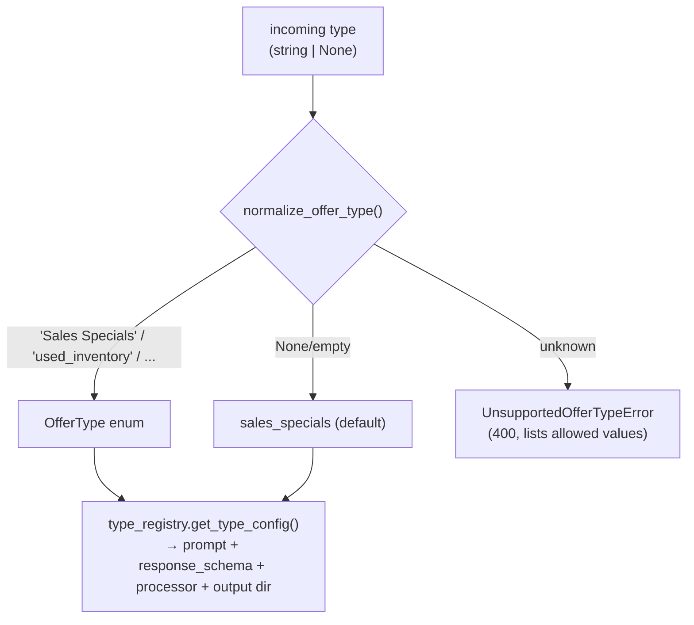

# Vehicle Offer Extraction

Scrapes automobile-dealer web pages, extracts structured offers with an LLM, and
packages the results per dealer. The pipeline supports **multiple offer types**;
`sales_specials` is the default and its behavior is unchanged from the original
implementation.

- [Supported types](#supported-types)
- [How to start](#how-to-start)
- [API / curl](#api--curl)
- [CLI](#cli)
- [Schedulers & timers](#schedulers--timers)
- [Parallel processing](#parallel-processing)
- [Output layout](#output-layout)
- [Diagrammatic flow](#diagrammatic-flow)
- [Adding a new type](#adding-a-new-offer-type)
- [Tests](#tests)

---

## Supported types

| Internal value | Excel `type` label | Status |
|----------------|--------------------|--------|
| `sales_specials` *(default)* | Sales Specials | ✅ production |
| `service_specials` | Service Specials | 🧪 placeholder prompt/schema |
| `schedule_service` | Schedule Service | 🧪 placeholder prompt/schema |
| `new_inventory` | New Inventory | 🧪 placeholder prompt/schema |
| `certified_inventory` | Certified Inventory | 🧪 placeholder prompt/schema |
| `used_inventory` | Used Inventory | 🧪 placeholder prompt/schema |
| `offer_to_purchase` | Offer To Purchase | 🧪 placeholder prompt/schema |

Rows whose `type` is **`Homepage`**, **`Contact Us`**, or **`Map`** are skipped
(logged, never fail the job). When no type is supplied anywhere, the app defaults
to `sales_specials`.

---

## How to start

### 1. Install

```bash
python -m venv .venv
source .venv/bin/activate
pip install -r requirements.txt
playwright install chromium   # one-time: browser for scraping
```

### 2. Configure `.env`

```bash
# One or more Gemini keys (comma-separated). Each concurrent LLM call uses a
# distinct key to spread load past a single key's rate limit.
GEMINI_API_KEYS=key1,key2,key3,key4,key5

# Optional overrides (defaults shown)
SCRAPER_MAX_WORKERS=5
DEALER_EXTRACT_WORKERS=5
LOCAL_STORAGE_DIR=./storage/offers
DEFAULT_EXCEL_PATH=offers/MWK00012GMC_Dealership_URLs.xlsx

# Scheduler (off by default)
SCHEDULER_ENABLED=false
```

### 3. Run the API

```bash
uvicorn app.main:app --reload --port 8000
```

Health check: `curl http://localhost:8000/health` → `{"status":"ok"}`
Interactive docs: `http://localhost:8000/docs`

---

## API / curl

The API returns immediately (`202`-style "processing"); scraping + extraction run
on background workers. Output is written under `storage/offers/<type>/`.

### Process a specific type

```bash
curl -X POST "http://localhost:8000/api/v1/offers/process" \
  -H "Content-Type: application/json" \
  -d '{
    "type": "service_specials",
    "path": "/Users/Mkurikur/Documents/voe/VEHICLE_OFFER_EXTRACTION/offers/example.xlsx"
  }'
```

```bash
curl -X POST "http://localhost:8000/api/v1/offers/process" \
  -H "Content-Type: application/json" \
  -d '{
    "type": "used_inventory",
    "path": "/Users/Mkurikur/Documents/voe/VEHICLE_OFFER_EXTRACTION/offers/example.xlsx"
  }'
```

### Default type (omit `type` → `sales_specials`)

```bash
curl -X POST "http://localhost:8000/api/v1/offers/process" \
  -H "Content-Type: application/json" \
  -d '{
    "path": "/Users/Mkurikur/Documents/voe/VEHICLE_OFFER_EXTRACTION/offers/example.xlsx"
  }'
```

### One curl per supported type

```bash
BASE="http://localhost:8000/api/v1/offers/process"
FILE="/Users/Mkurikur/Documents/voe/VEHICLE_OFFER_EXTRACTION/offers/example.xlsx"

for T in sales_specials service_specials schedule_service new_inventory \
         certified_inventory used_inventory offer_to_purchase; do
  curl -X POST "$BASE" -H "Content-Type: application/json" \
    -d "{\"type\": \"$T\", \"path\": \"$FILE\"}"
  echo
done
```

### Invalid type → clear validation error (HTTP 400)

```bash
curl -X POST "http://localhost:8000/api/v1/offers/process" \
  -H "Content-Type: application/json" \
  -d '{"type": "homepage", "path": "x.xlsx"}'
```
```json
{"error":{"code":"unsupported_offer_type",
  "message":"Unsupported offer type: homepage. Supported types are: sales_specials, service_specials, schedule_service, new_inventory, certified_inventory, used_inventory, offer_to_purchase."}}
```

### List supported types

```bash
curl "http://localhost:8000/api/v1/offers/types"
```

### Backwards-compatible endpoint

The original `GET /generate` still works and defaults to `sales_specials`:

```bash
curl "http://localhost:8000/api/v1/offers/generate?excel_path=offers/example.xlsx"
curl "http://localhost:8000/api/v1/offers/generate?excel_path=offers/example.xlsx&type=used_inventory"
```

---

## CLI

Runs one type end-to-end synchronously (no API/broker needed).

```bash
# Specific type
python main.py --type service_specials \
  --path /Users/Mkurikur/Documents/voe/VEHICLE_OFFER_EXTRACTION/offers/example.xlsx

# Default type (sales_specials)
python main.py --path /Users/Mkurikur/Documents/voe/VEHICLE_OFFER_EXTRACTION/offers/example.xlsx

# Legacy positional path still works (defaults to sales_specials)
python main.py offers/example.xlsx
```

---

## Schedulers & timers

APScheduler runs **in-process**, started automatically by the FastAPI app on
`uvicorn` startup, and is **off by default**. Enable it with
`SCHEDULER_ENABLED=true` (then restart `uvicorn`). Each type has its own cron
job that publishes a scrape event for that type against `DEFAULT_EXCEL_PATH`.

Each type runs **once a month on the 5th**, staggered to a different hour.

| Offer type | Default cron | Time | Env override |
|------------|--------------|------|--------------|
| `sales_specials` | `0 1 5 * *` | 5th @ 01:00 | `SCHEDULE_SALES_SPECIALS` |
| `service_specials` | `0 2 5 * *` | 5th @ 02:00 | `SCHEDULE_SERVICE_SPECIALS` |
| `schedule_service` | `0 3 5 * *` | 5th @ 03:00 | `SCHEDULE_SCHEDULE_SERVICE` |
| `new_inventory` | `0 4 5 * *` | 5th @ 04:00 | `SCHEDULE_NEW_INVENTORY` |
| `certified_inventory` | `0 5 5 * *` | 5th @ 05:00 | `SCHEDULE_CERTIFIED_INVENTORY` |
| `used_inventory` | `0 6 5 * *` | 5th @ 06:00 | `SCHEDULE_USED_INVENTORY` |
| `offer_to_purchase` | `0 7 5 * *` | 5th @ 07:00 | `SCHEDULE_OFFER_TO_PURCHASE` |

Cron format is standard 5-field (`minute hour day month day_of_week`) in the
`APP_TIMEZONE` timezone (default `Asia/Kolkata`). Example override:

```bash
SCHEDULER_ENABLED=true
SCHEDULE_SALES_SPECIALS="30 1 5 * *"     # 5th of month @ 01:30
SCHEDULE_USED_INVENTORY="0 6 5 * *"      # 5th of month @ 06:00
```

Config lives in `app/config/scheduler_config.py`; the runner in
`app/scheduler/runner.py`.

---

## Single-run lock (one run at a time)

Only **one** offer-generation run may be in flight at any moment. This prevents a
new request from interrupting or piling up behind work already in progress.

- When you `POST /process` (or `GET /generate`) and **no** run is active, the run
  starts and you get the normal `processing` response.
- When a run **is** active, the request is rejected immediately with **HTTP 409**
  and a message naming the offer type that is currently running — so you know to
  wait and retry once it finishes:

```json
{
  "error": {
    "code": "offer_run_in_progress",
    "message": "An offer-generation run for 'sales_specials' is currently running. Please wait until it completes before starting another."
  }
}
```

The lock is released automatically when the run finishes (all dealers extracted)
or if scraping fails before any dealer is dispatched. The **scheduler** respects
the same lock: a scheduled job is skipped (logged) if a run is already active.

Implementation: `app/events/run_lock.py`.

---

## Parallel processing

Two independent worker pools, **both default to 5**:

| Setting | Default | Meaning |
|---------|---------|---------|
| `SCRAPER_MAX_WORKERS` | **5** | Dealer URLs scraped in parallel (stage B). Each worker runs its own headless Chromium. |
| `DEALER_EXTRACT_WORKERS` | **5** | Dealers whose offers are extracted in parallel (stage C). Keep near the number of LLM keys. |

LLM concurrency is naturally capped by the API-key pool: at most `len(keys)`
extractions run at once, each on a distinct key (backpressure, no 429s). Scraper
and LLM concurrency are decoupled.

---

## Output layout

Every type writes only under its own subfolder — ZIPs and errors never mix:

```
storage/offers/
├── sales_specials/
│   ├── zip/      <dealer>_<date>.zip     # one .xlsx per OEM with offers
│   └── errors/   error_<dealer>_<date>.txt
├── service_specials/
│   ├── zip/
│   └── errors/
├── used_inventory/
│   ├── zip/
│   └── errors/
└── ... (one folder per type)
```

Path helpers: `app/utils/output_paths.py` —
`get_output_directory(type)`, `get_zip_directory(type)`, `get_error_directory(type)`.

---

## Diagrammatic flow

### Multi-type routing

```mermaid
flowchart LR
    subgraph Entrypoints
        API["POST /api/v1/offers/process<br/>{type?, path}"]
        CLI["python main.py --type --path"]
        SCH["APScheduler<br/>per-type cron"]
    end
    REG["type_registry.get_processor(offer_type)<br/>(default: sales_specials)"]
    P1["SalesSpecialsProcessor<br/>(real logic)"]
    P2["6× placeholder processors<br/>(shared base)"]
    OUT["storage/offers/&lt;type&gt;/{zip,errors}"]

    API -->|publish {offer_type, excel_path}| REG
    CLI --> REG
    SCH -->|publish {offer_type, excel_path}| REG
    REG --> P1
    REG --> P2
    P1 --> OUT
    P2 --> OUT
```

### Broker pipeline (per event)

```mermaid
flowchart LR
    A["scrape_broker<br/>1 worker"]
    B["extract_broker<br/>5 workers"]
    Z["storage/offers/&lt;type&gt;/"]

    A -->|read Excel, filter by type label,<br/>skip Homepage/Contact Us/Map| A
    A -->|scrape URLs in parallel ×5| A
    A -->|publish 1 msg/dealer<br/>{offer_type, urls...}| B
    B -->|processor.build_dealer<br/>dealers parallel ×5| B
    B --> Z
```

### How the type is resolved everywhere



See [`docs/ARCHITECTURE.md`](docs/ARCHITECTURE.md) for the original stage-by-stage
pipeline internals (scraping, LLM key pool, dedupe).

---

## Adding a new offer type

Adding a type touches only config + three small files:

1. Add a value to `OfferType` and its Excel label in `app/config/offer_types.py`.
2. Create `app/prompts/<type>.py` (a `SYSTEM_PROMPT`).
3. Create `app/response_templates/<type>.py` (a `RESPONSE_SCHEMA`).
4. Create `app/processors/<type>_processor.py` (subclass `BaseProcessor`, or reuse it).
5. Register the processor in `app/config/type_registry.py` and add a cron entry in
   `app/config/scheduler_config.py` + `app/core/config.py`.

No other files need changes — the API, CLI, scheduler, and broker all route
through the registry.

---

## Tests

```bash
pytest -q
```

Covers: default → `sales_specials`, explicit-type filtering, unsupported rows
skipped, invalid API type validation, output isolation per type, and Sales
Specials delegation to the original logic.

---

## Known TODOs

- Prompts in `app/prompts/*` for the 6 non–sales types are **placeholders**
  (marked `# TODO`) and need production content.
- Response schemas in `app/response_templates/*` for those types are minimal
  placeholders (3-4 fields).
- Placeholder processors emit simple JSON output; real per-type extraction /
  Excel formatting is future work.
