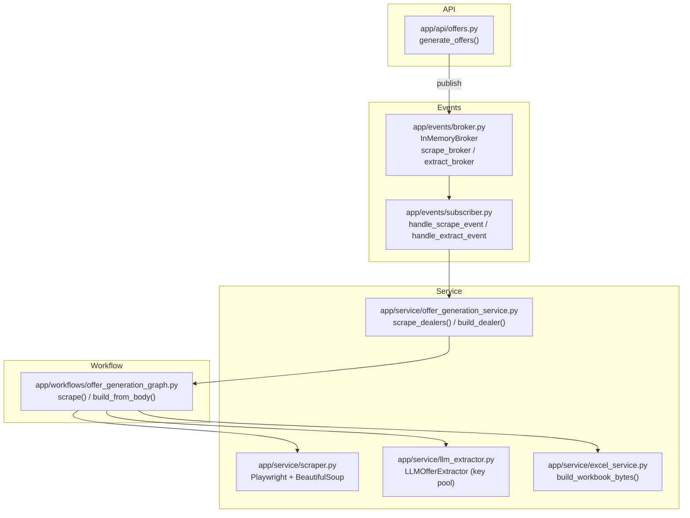
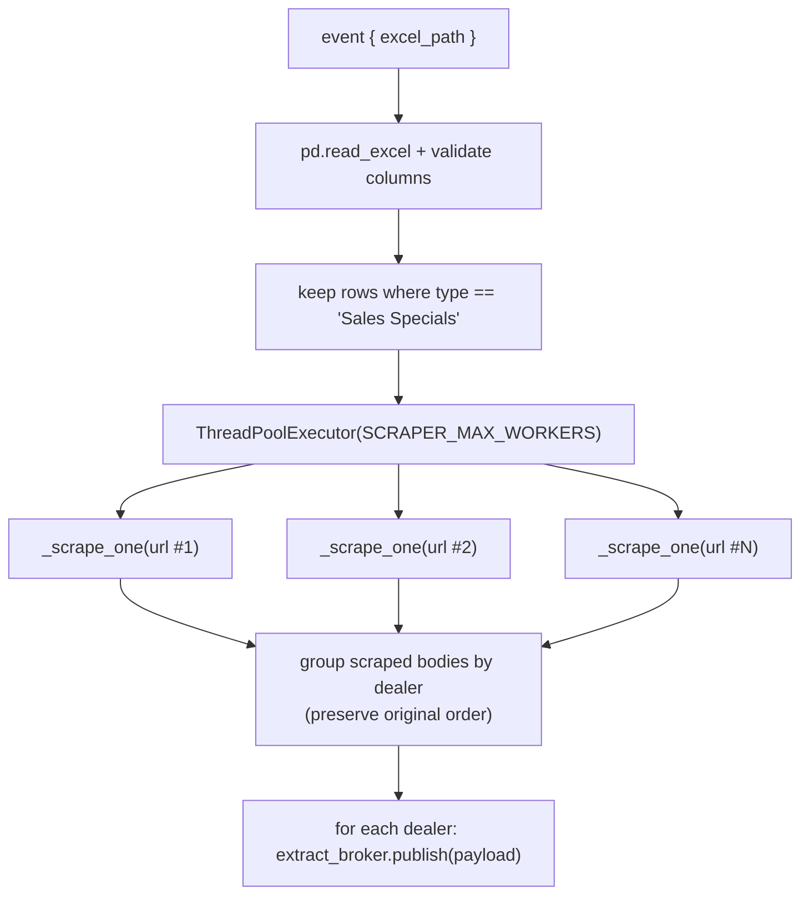
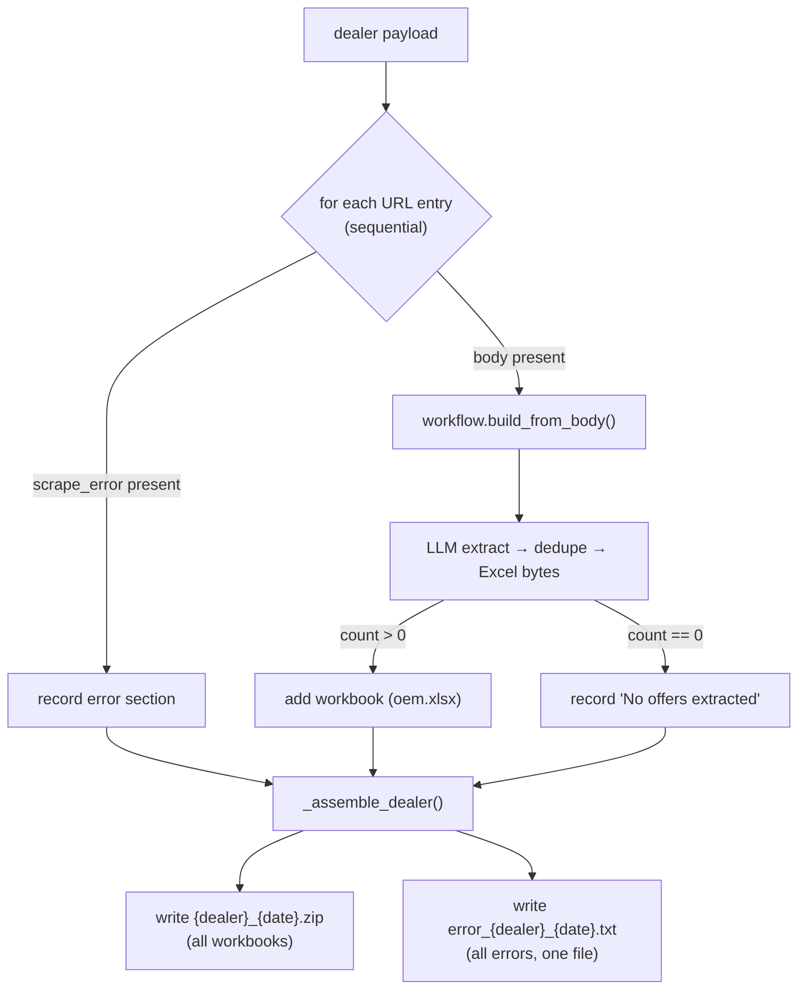
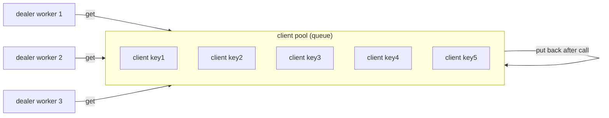
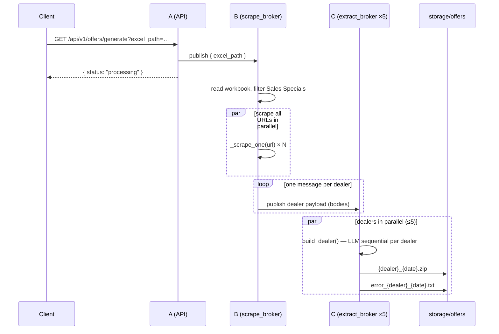

# Vehicle Offer Extraction — Architecture & Code Flow

This document explains how the offer-generation pipeline works end to end, from
the HTTP request to the per-dealer Excel zip written on disk.

> **Multi-type note:** the pipeline now supports multiple offer types (default
> `sales_specials`). Type resolution, routing, per-type prompts/schemas/output
> folders, and schedulers are documented in the top-level [README](../README.md).
> The stages below describe the shared mechanics, which are identical for every
> type; only the Excel filter label, prompt/schema, and output subfolder change
> per type. Outputs are written under `storage/offers/<type>/{zip,errors}/`.

---

## 1. High-level pipeline (A → B → C)

The system is a 3-stage, in-process pub/sub pipeline. Each stage runs on its own
background worker thread(s) so the API returns immediately.

```mermaid
flowchart LR
    A["**A — API**<br/>GET /api/v1/offers/generate"]
    B["**B — scrape_broker**<br/>1 worker"]
    C["**C — extract_broker**<br/>5 workers"]
    Z["storage/offers/<br/>dealer .zip + error .txt"]

    A -->|publish { excel_path }| B
    B -->|scrape ALL Sales Specials URLs in parallel| B
    B -->|publish 1 message per dealer| C
    C -->|LLM sequential per dealer,<br/>dealers parallel ×5| C
    C --> Z
```

| Stage | Broker | Workers | Responsibility |
|-------|--------|---------|----------------|
| A | — | request thread | Publish the excel path, return `202`-style "processing" |
| B | `scrape_broker` | 1 | Read workbook, scrape every Sales Specials URL **in parallel**, fan out per-dealer data |
| C | `extract_broker` | 5 | Per dealer: LLM extract **sequentially**; **different dealers run in parallel** |

---

## 2. Where each piece lives



---

## 3. Stage B — scraping (fan-out)

`handle_scrape_event` → `OfferGenerationService.scrape_dealers()`



Each `_scrape_one` calls `workflow.scrape(url)` (Playwright render → visible body
text). On failure it records `scrape_error` instead of a body, so a bad URL never
stops the batch.

**B → C message shape (one per dealer):**

```jsonc
{
  "dealer_id": "HWA00001GMC",
  "dealer_name": "Heyward Allen GMC",
  "date_token": "20260825",
  "urls": [
    { "oem": "GMC",      "type": "Sales Specials", "url": "https://…", "body": "…", "scrape_error": null },
    { "oem": "Cadillac", "type": "Sales Specials", "url": "https://…", "body": null, "scrape_error": "…" }
  ]
}
```

---

## 4. Stage C — extraction (fan-in per dealer)

`handle_extract_event` → `OfferGenerationService.build_dealer()`

One dealer per extract-broker worker. Within a dealer the URLs are processed
**sequentially**; across dealers up to **5 run in parallel** (one per worker).



`build_from_body` runs the extraction half of the workflow only (no scraping):

```
_extract_with_llm  →  _normalize_offers (dedupe)  →  _create_excel
```

---

## 5. LLM key pool (parallelism without rate-limit blowups)

`LLMOfferExtractor` holds **one client per API key** in a `queue.Queue`. Every
`extract()` checks a client out, runs the call, and returns it — so at most
`len(keys)` LLM calls run at once, each on a **distinct key**.



- **Scraper concurrency** (`SCRAPER_MAX_WORKERS`) and **LLM concurrency**
  (number of keys) are decoupled: you can scrape 8-wide while the pool caps LLM
  calls at 5.
- If a 6th extraction starts before a key frees up, it blocks on `queue.get()`
  until one returns — natural backpressure, no 429s.

---

## 6. End-to-end sequence



---

## 7. Configuration (`.env`)

| Setting | Default | Meaning |
|---------|---------|---------|
| `GEMINI_API_KEYS` | — | Comma-separated keys; each concurrent LLM call uses a distinct one (falls back to `GEMINI_API_KEY`) |
| `SCRAPER_MAX_WORKERS` | `5` | URLs scraped in parallel in stage B |
| `DEALER_EXTRACT_WORKERS` | `5` | Dealers extracted in parallel in stage C (keep near key count) |
| `MAX_BODY_CHARS` | `350000` | Max scraped text sent to the LLM |
| `LOCAL_STORAGE_DIR` | `./storage/offers` | Output folder for zips + error files |

---

## 8. Outputs

For each dealer, in `storage/offers/`:

- `{dealer_id}_{dealer_name}_{date}.zip` — one `.xlsx` per OEM that produced offers.
- `error_{dealer_id}_{dealer_name}_{date}.txt` — **single** file listing every
  OEM URL that failed to scrape or yielded no offers (sections separated by a
  divider). No error zip.

> The CLI entry point ([main.py](../main.py)) runs the same two stages
> synchronously (scrape → extract) for local runs without the API/brokers.
